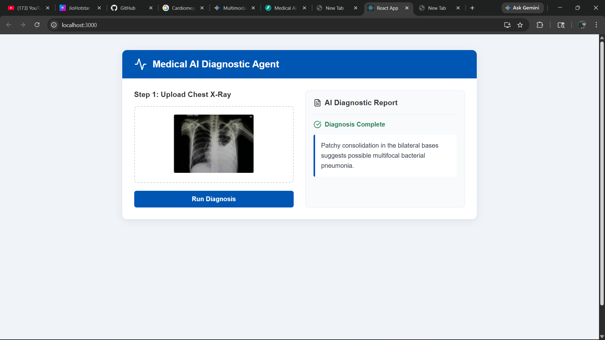
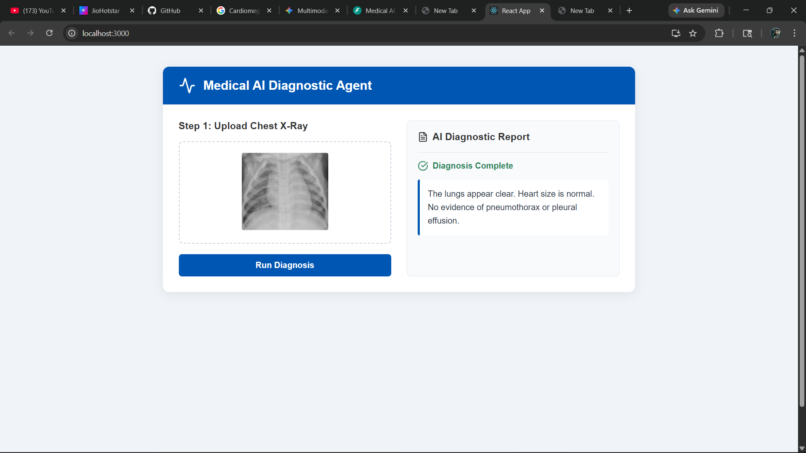
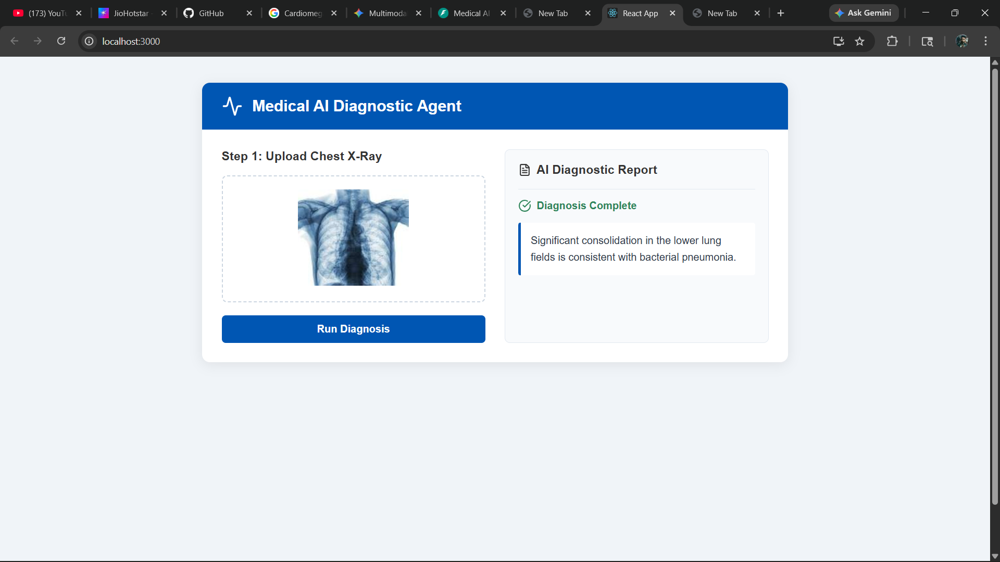
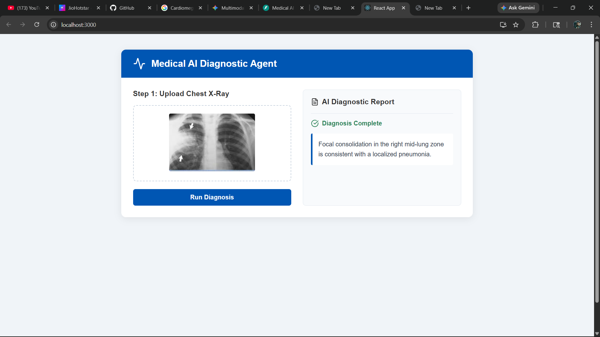
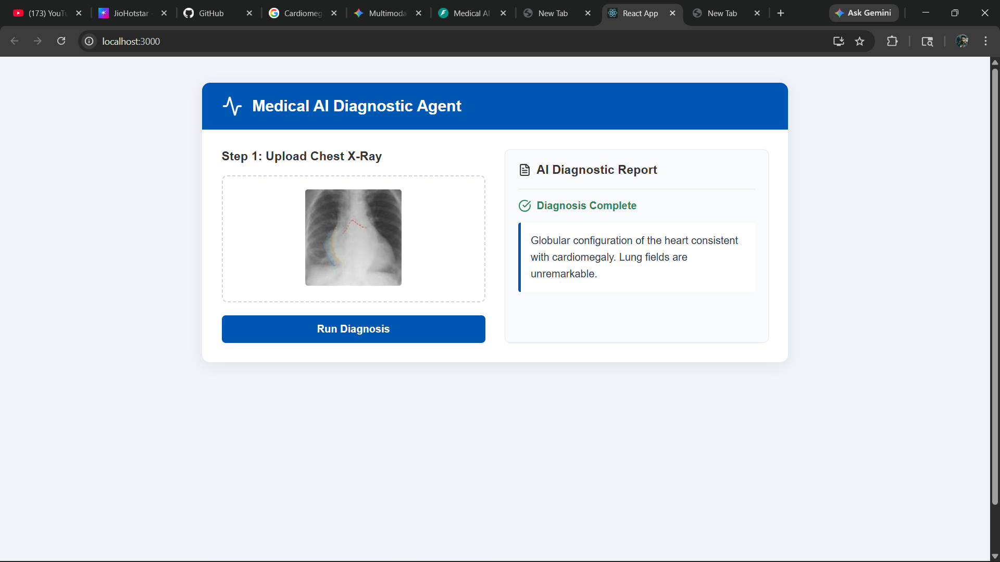

# Multimodal Medical AI Diagnostic Agent

### Overview
This project presents a Multimodal Artificial Intelligence system designed to assist radiologists by providing preliminary diagnostic reports from Chest X-Ray images. The system integrates Deep Learning based Computer Vision with a specialized logic-based Retrieval Agent to bridge the gap between visual pixel data and professional medical terminology.

### Key Features
- Automated Feature Extraction: High-level visual representation using deep residual learning.
- Cross-Modal Mapping: A learnable Projection Bridge that aligns image vectors with a clinical report space.
- Scalable Backend: Asynchronous API handling for real-time diagnostic processing.
- Responsive UI: A React-based dashboard for seamless image management and report visualization.
- Fail-Safe Architecture: Built-in shape correction to ensure mathematical consistency across neural layers.

### Tech Stack
- Frontend: React.js, Axios, CSS3
- Backend: FastAPI (Python), Uvicorn
- AI/ML: PyTorch, Torchvision, NumPy, Pandas
- Models: ResNet18 (Visual Encoder)
- Version Control: Git, GitHub

### System Architecture
The pipeline consists of four distinct stages:
1. Preprocessing: Images are resized to 224x224 and normalized using ImageNet statistics to match the encoder's expected input distribution.
2. Visual Encoding: A ResNet18 backbone (stripped of its classification head) extracts a 512-dimensional latent vector representing the biological features of the X-ray.
3. Latent Alignment: The 512-D vector is passed through a Linear Projection Bridge. This stage applies Global Average Pooling to ensure a fixed-size feature map.
4. Report Generation: The projected vector is used by the Medical Agent to index and retrieve the most statistically relevant diagnostic text from a curated metadata library.

### How the Evaluation Works
The diagnostic accuracy is determined by the alignment between the Visual Feature Vector ($V$) and the Metadata Embeddings ($M$). 
- The model minimizes the distance between the projected image features and the ground-truth report labels.
- The Projection Bridge is trained using Cross-Entropy loss to classify the image into the most appropriate diagnostic category defined in the training metadata.

### Demo
Below are the visual representations of the system in operation:

#### Diagnostic Output


#### Diagnostic Output


#### Diagnostic Output


#### Diagnostic Output


#### Diagnostic Output

### Project Structure
```text
Medical-diagnostic-agent/
├── data/
│   └── raw/                # Original X-Ray dataset and metadata.csv
├── frontend/               # React.js source code and assets
├── models/
│   └── checkpoints/        # Saved model weights (.pth)
├── screenshots/            # Images for documentation
├── src/
│   ├── api/                # FastAPI endpoint logic
│   ├── llm/                # Medical Agent retrieval logic
│   ├── vision/             # ResNet18 and Projection Bridge definitions
│   └── main.py             # System orchestrator
├── train.py                # Training and alignment script
├── requirements.txt        # Python dependency list
└── README.md               # Project documentation